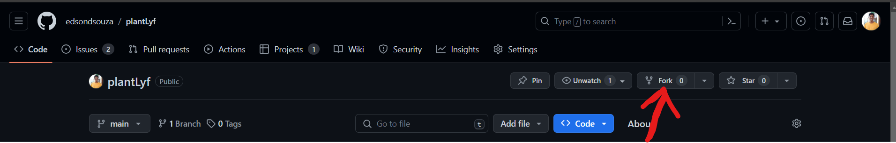
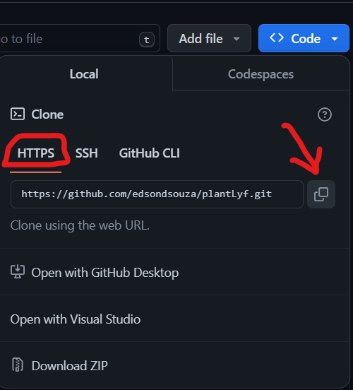

# plantLyf

## Fork the repository


- Once "forked" go to your account repository section and open the repository. 
- Then clone the repository using the commmand 👇
```git clone <add-repository-link>```



## Run the project
- Open the terminal and run `flask run`

### NOTE
- Please create a new branch before making the pull request. 👉👉 [How to create pull request](https://opensource.com/article/19/7/create-pull-request-github) 👈👈
